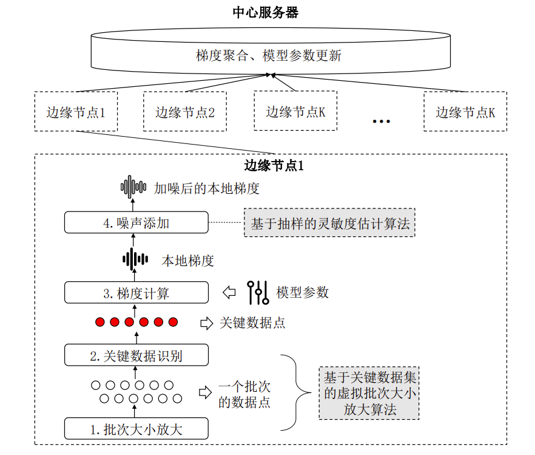
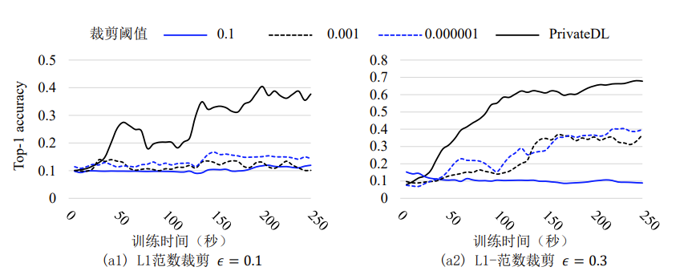
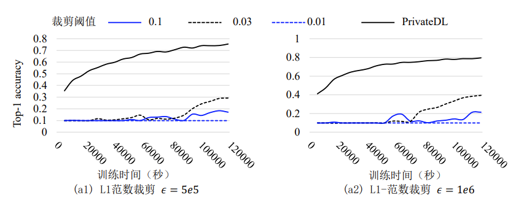
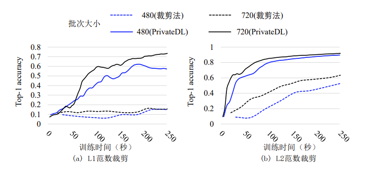
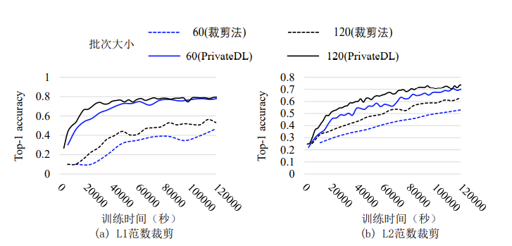

# PrivateDL

- [PrivateDL](#privatedl)
  - [1.介绍](#1介绍)
  - [2.代码相关](#2代码相关)
    - [2.1环境配置](#21环境配置)
    - [2.2运行](#22运行)
      - [2.2.1 代码层次结构](#221-代码层次结构)
      - [2.2.2 参数介绍](#222-参数介绍)
      - [2.2.3 运行](#223-运行)
    - [2.3支持的模型与数据集](#23支持的模型与数据集)
  - [3.实验细节描述](#3实验细节描述)
    - [3.1本地噪声降噪](#31本地噪声降噪)
    - [3.2全局噪声降噪](#32全局噪声降噪)
  - [4.项目成员](#4项目成员)
    - [4.1 北京理工大学](#41-北京理工大学)

## 1.介绍

PrivateDL是本论文提出的一种新的差分隐私深度学习框架，该框架从本地噪声与全局噪声的角度对差分隐私深度学习中的噪声添加进行优化，从而实现减少差分隐私噪声的目的。

PrivateDL框架的流程图如上所示，其中基于关键数据集的虚拟批次大小放大算法，通过放大训练数据时的批次大小来减少全局噪声的添加，进而提高模型的精度。基于抽样的灵敏度算法则不需要进行数据的裁剪就可以实现灵敏度的计算，避免了传统的裁剪方法的一刀切式的计算灵敏度所产生的误差，进而提高了模型的精度。

## 2.代码相关

### 2.1环境配置

### 2.2运行

#### 2.2.1 代码层次结构

#### 2.2.2 参数介绍

#### 2.2.3 运行

### 2.3支持的模型与数据集

| 模型      | 对应数据集     |
| --------- | -------------- |
| LeNet-5   | MNIST数据集    |
| AlexNet   | Cifar-10数据集 |
| ResNet-18 | ImageNet数据集 |

## 3.实验细节描述

### 3.1本地噪声降噪

测试本地噪声降噪时，需要测试在不同隐私预算下PrivateDL与裁剪法的模型精度对比

实验测试了包括LeNet-5,AlexNet,ResNet-18三种网络，部分结果如下：

 

### 3.2全局噪声降噪

测试全局噪声降噪时，需要测试不同批次大小下PrivateDL与裁剪法的模型精度对比

实验测试了包括LeNet-5,AlexNet,ResNet-18三种网络，部分结果如下：

 

## 4.项目成员

### 4.1 北京理工大学

李东 欧阳峻彦

