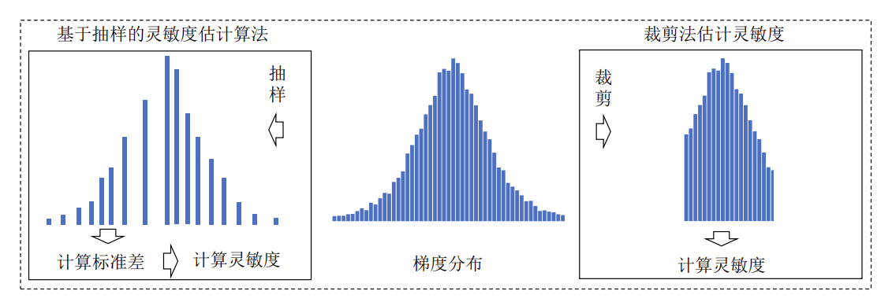

# PrivateDL

[Accurate Differentially Private Deep Learning on the Edge](https://ieeexplore.ieee.org/document/9372811)

- [PrivateDL](#privatedl)
  - [1.介绍](#1介绍)
    - [1.1 基于抽样的灵敏度估计算法(Sampling-Based Sensitivity Estimation)](#11-基于抽样的灵敏度估计算法sampling-based-sensitivity-estimation)
    - [1.2 基于关键数据点的虚拟批次放大算法(Virtual Batch Size Amplification Via Critical Set)](#12-基于关键数据点的虚拟批次放大算法virtual-batch-size-amplification-via-critical-set)
  - [2.代码和环境配置](#2代码和环境配置)
    - [2.1环境配置](#21环境配置)
    - [2.2运行](#22运行)
      - [2.2.1 代码层次结构](#221-代码层次结构)
      - [2.2.2 参数介绍](#222-参数介绍)
      - [2.2.3 运行](#223-运行)
    - [2.3支持的模型与数据集](#23支持的模型与数据集)
  - [3.实验细节描述](#3实验细节描述)
    - [3.1本地噪声降噪](#31本地噪声降噪)
    - [3.2全局噪声降噪](#32全局噪声降噪)
  - [4.项目成员](#4项目成员)
    - [4.1 北京理工大学](#41-北京理工大学)

## 1.介绍

深度学习越来越多地被运用于边缘侧的本地数据训练中, 而边缘侧的深度学习要面临的一个主要问题就是如何在保证精度的情况下尽可能的防止隐私泄露。差分隐私技术作为一种常用的深度学习隐私保护方法, 其通过向数据添加特定噪声的方式来进行隐私保护, 但是差分隐私所带的边缘侧端的本地噪声以及中心服务器端的全局噪声会降低模型的准确率。而已有的边缘侧深度学习差分隐私框架注重于通过梯度裁剪的方法进行本地噪声的添加, 然而这种方法忽略了边缘侧梯度的动态变化的特性以及其对全局噪声的影响。因此本项目设计并实现了一个新的差分隐私深度学习框架 (PrivateDL)，来减少边缘端深度学习训练时本地噪声的添加以及全局噪声的添加, 进而实现同等隐私保护程度下更高的模型精度。最终通过实验表明了该框架的有效性, 与现有框架相比, PrivateDL框架在模型准确性方面有着最高5倍的提升。


PrivateDL框架的流程图如下所示：


### 1.1 基于抽样的灵敏度估计算法(Sampling-Based Sensitivity Estimation)

该算法在数据训练时对需要计算灵敏度的数据 (例如梯度) 进行随机取样, 然后计算取样出的数据的标准差,进而通过标准差来计算数据的灵敏度。相比于裁剪法计算灵敏度, 该方法能够动态地计算数据的灵敏度。

### 1.2 基于关键数据点的虚拟批次放大算法(Virtual Batch Size Amplification Via Critical Set)
该算法通过识别一个批次中的关键数据点来去除冗余数据, 以此来减少模型训练时对边缘节点的资源压力, 从而节省训练时间与节点资源,使得边缘端能够承受更大的batch size,进而减少全局噪声的添加。该方法基于SlimML实现，其中SlimML参见[SlimML](https://github.com/LINC-BIT/SlimML)。

## 2.代码和环境配置

### 2.1环境配置

### 2.2运行

#### 2.2.1 代码层次结构

#### 2.2.2 参数介绍

#### 2.2.3 运行


### 2.3支持的模型与数据集


| 模型      | 对应数据集     |
| --------- | -------------- |
| LeNet-5   | MNIST数据集    |
| AlexNet   | Cifar-10数据集 |
| ResNet-18 | ImageNet数据集 |


## 3.实验细节描述

### 3.1本地噪声降噪

测试本地噪声降噪时，需要测试在不同隐私预算下PrivateDL与裁剪法的模型精度对比

```bash

```


实验测试了包括LeNet-5,AlexNet,ResNet-18三种网络，部分结果如下：

 


### 3.2全局噪声降噪

测试全局噪声降噪时，需要测试不同批次大小下PrivateDL与裁剪法的模型精度对比

```bash

```

实验测试了包括LeNet-5,AlexNet,ResNet-18三种网络，部分结果如下：

 


## 4.项目成员

### 4.1 北京理工大学

李东 欧阳峻彦


